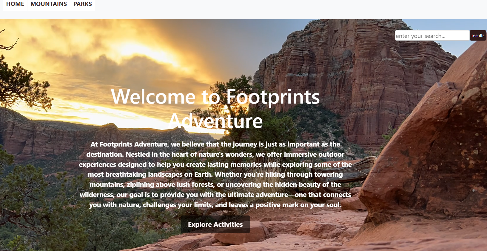

# Footprints Adventure

## Synopsis

 Welcome to Footprints Aventure, a stunning natural destination offering breathingtaking landscapes, parks, mountains, outdoor aventure and opportunities for relaxation and exploration. Make sure to click on the "Explore Activities" button on the home page to view few of the list of activities we offer and if you have any additional questions please click on "contact" for our cintact information.
 
 ##
This is my second capstone projcet for my Front-end Developement class.

## Technology Use
>HTML

>CSS

>Bootstrap

>ChatGPT

## Features
>Home Page: The home page gives you a brief discription of our site. it also has a navigation bar to help our visitors explore the website easily.

>Mountain Page: the mountain page provides deatils about elevation, effort, coordinates and discription for each selected mountain.

>parks Page: the park page offers various park types for you to choose from. Once you select a park type, it provides details about the selected park, including the park name, location, full adress, latitude,and longitude. There is also a filter button to help you refine your search.

>Explore Activites: clicking the "Explore Activities" button on the home page takes you to a page featuring a carousel slider showcasing some suggested activities four our coustomers.

>Footor: the footor contains an "About Us" link that provides more information about Footprints Adventure. There is also a "Contact Us" link that includes our phone number, email adress, and office hours. Additionally, the footor features our social media handles for anyone interested in following us online.

## Screenshots of each page list in "features"
>
>
>
>
>
>
>

##
>I enjoyed using both HTML and CSS to style my home page. It was a little challenging inserting the background video and stacking the writings over it but I was able to figure it out after asking questions and doing my own resarch to achieve what I wanted. 

##
Below is a snippet of my CSS styling.

#
>Thank You For Reading!